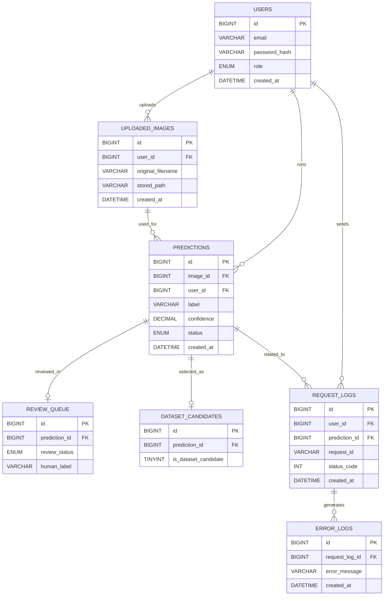

# ERD (Entity Relationship Diagram)

本データベースは、CNN欠陥検出システムにおける推論結果管理、ログ管理、レビュー、再学習データ生成を目的として設計されている。

---

## ER図（Mermaid）

---

## 関係説明

* 1人のユーザーは複数の画像をアップロードできる
* 1人のユーザーは複数の推論を実行できる
* 1つの画像に対して複数の推論が可能
* 推論結果はレビュー対象として登録される場合がある
* 推論結果は再学習データ候補として登録される場合がある
* リクエストログはエラーログと関連付けられる

---

## 設計の特徴

* 推論結果を中心とした構造
* ログとビジネスデータの分離
* 品質改善（レビュー・再学習）を考慮
* SaaS型運用を想定した設計
