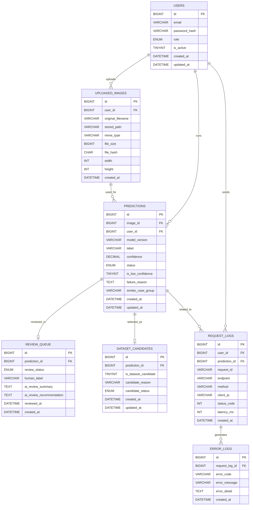

# ERD (Entity Relationship Diagram)

このデータベースは **CNN欠陥検出システム** における推論結果管理、ログ管理、レビュー、再学習データ生成を目的として設計されています。以下は GitHub Markdown に適した整理済みの内容です。

---

##  ER図（Mermaid）

---

## 関係説明
- ユーザーは複数の画像をアップロード可能  
- ユーザーは複数の推論を実行可能  
- 1つの画像に対して複数の推論が可能  
- 推論結果はレビュー対象として登録される場合がある  
- 推論結果は再学習データ候補として登録される場合がある  
- ユーザーは複数のAPIリクエストを送信可能  
- リクエストログはエラーログと関連付けられる  

---

## 設計の特徴
- **推論結果を中心とした構造**  
- **ログとビジネスデータの分離**  
- **品質改善（レビュー・再学習）を考慮**  
- **SaaS型運用を想定した設計**  
- **将来的な分析項目の拡張を考慮**  

