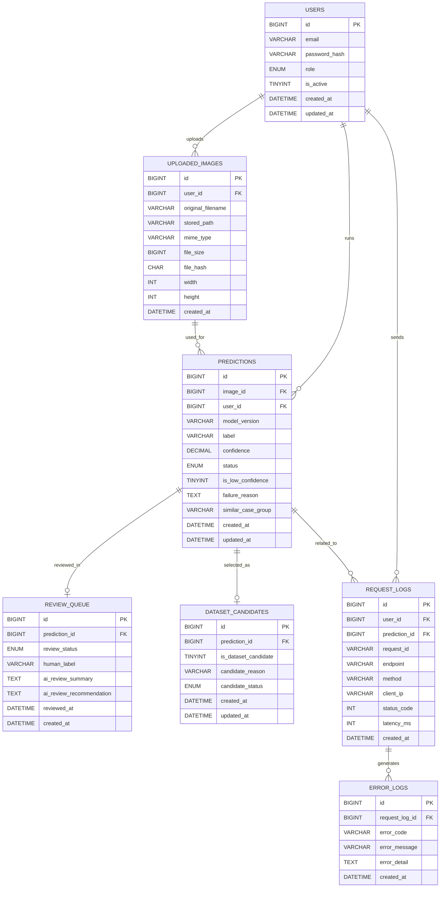

# ERD (Entity Relationship Diagram)

CNNによる欠陥検出AIシステムにおいて、以下の機能を統合的に管理するために設計されています。

- 推論結果管理
- APIログ管理
- エラーログ管理
- ヒューマンレビュー管理
- 再学習データ候補管理

単なる推論結果保存ではなく、**AIサービスの運用・品質改善・分析基盤を支えるデータモデル**として設計されています。

---

## ER図



---

## リレーション説明

| リレーション | カーディナリティ | 説明 |
|---|---|---|
| `users` → `uploaded_images` | 1 : N | ユーザーは複数の画像をアップロードできる |
| `users` → `predictions` | 1 : N | ユーザーは複数回推論を実行できる |
| `uploaded_images` → `predictions` | 1 : N | 1画像に対してモデル変更・再推論など複数回の推論が発生しうる |
| `predictions` → `review_queue` | 1 : 0..1 | 低信頼度予測など一部のみレビュー対象となる |
| `predictions` → `dataset_candidates` | 1 : 0..1 | レビュー結果を基に再学習候補として選定される場合がある |
| `users` → `request_logs` | 1 : N | ユーザーは複数のAPIリクエストを送信する |
| `predictions` → `request_logs` | 1 : N | 推論関連リクエストと推論結果を紐付ける（推論前失敗分は nullable）|
| `request_logs` → `error_logs` | 1 : N | 1リクエストから複数のエラーイベントが発生しうる |

---

## 設計の特徴

### 推論結果中心の構造
画像ではなく **推論結果（prediction）** を中心に設計することで、モデル性能分析・誤検知分析・再学習データ生成を容易にしています。

### ログとビジネスデータの分離
request_logs と error_logs を分離することで、運用監視と障害分析を独立して効率的に行えます。

### 品質改善ループ
```
低信頼予測 → レビュー → 再学習候補
```
このフローをデータとして一貫管理しています。

### SaaS型AIサービスを想定した設計
マルチユーザー・APIベース推論・運用ログ監視を前提とした構造になっています。

### 将来的な拡張性
- AIレビュー補助
- モデルバージョン比較
- 誤検知分析
- データセット品質分析
